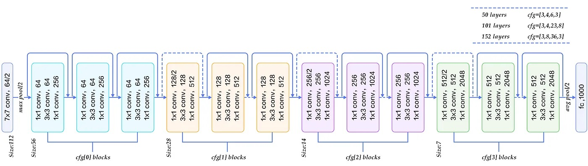
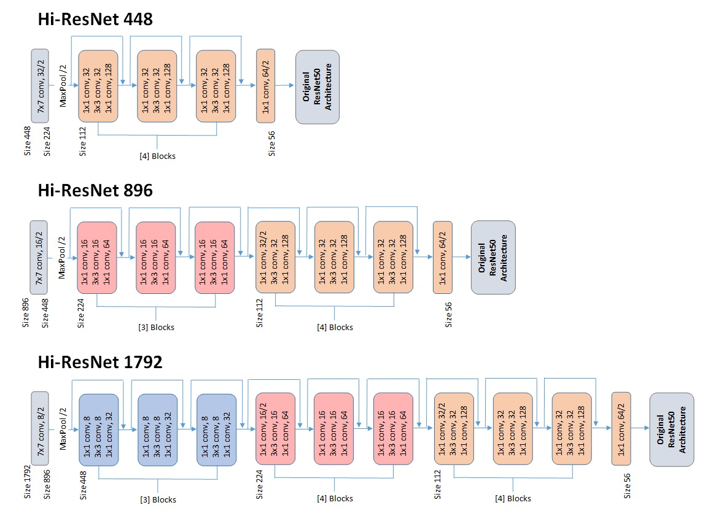

# Hi-ResNet

Hi-ResNet is an expansion of the original ResNet50 architecture to allow for higher resolution inputs (448x448, 896x896, 1792x1792). It was created as an alternative to image tiling and may prove useful in analyzing large images with fine details necessary for classification. The inception came from a personal coin grading project, which relies on evaluating fine details of both the front and back of the entirety of the coin. I quickly realized that a 224x224 image completely obscures fine details needed to grade the coin. The model saw ~40% accuracy increase when switching to Hi-ResNet and I believe it could even see more if I had a larger dataset.

# Architecture
The architecture is just a continuation from the original paper. I have included an architecture diagram for the original ResNet as well as the model heads for the three Hi-ResNet models below. The pattern from the original paper is continued up to the correct input size. The initial 7x7 conv and max pooling layers are removed from the original architecture imported from Tensorflow and replaced by the Hi-ResNet head.

## Original Architecture

## Hi-ResNet Heads


# Training
You will need to retrain/finetune this model with significant data because it was not trained on a large general dataset such as imagenet. There are three Hi-ResNet model heads to choose from, depending on your image input size. The three available parameters to pass through are:
1) <b>size</b> (Int)  
    (448, 896, or 1792) Size of the input image.
3) <b>weights</b> (Str)  
    ("Res50" or "None") Set to "Res50" to train with original ResNet50 weights within the base model and randomly initialized weights for the Hi-ResNet head. "None" will randomly initialize everything. You can also initialize weights from my pre-trained coin grading dataset after building the model, which may or may not help with finetuning. See example code below.
  4) <b>classes</b> (Int)  
      Will set the number of output neurons for the final layer.

If you want to tweak anything else such as the fully connected layers, dropout, regularization, you will need to revise the code.

# Example code
```python
model = HiResNet(size, weights, classes) #will return the Hi-ResNet model.
```

Example:
```python
# Creates the Hi-ResNet model for an 896x896 input image, randomly initializes weights, and assigns 50 output neurons
model = HiResNet(896, "Res50", 50)
# Initializes my pretrained weights from a coin grading dataset

compiler
run
```
